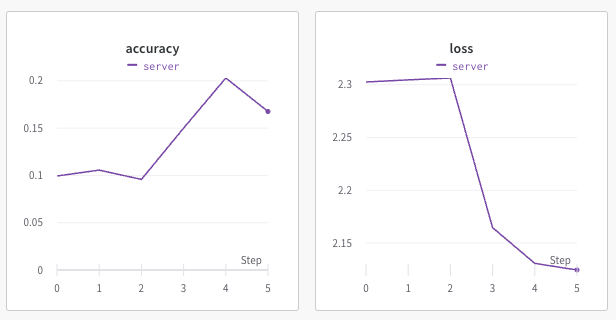
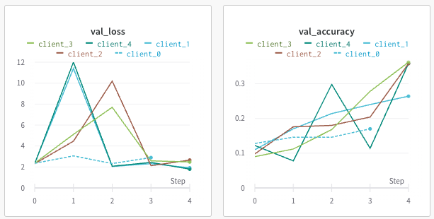
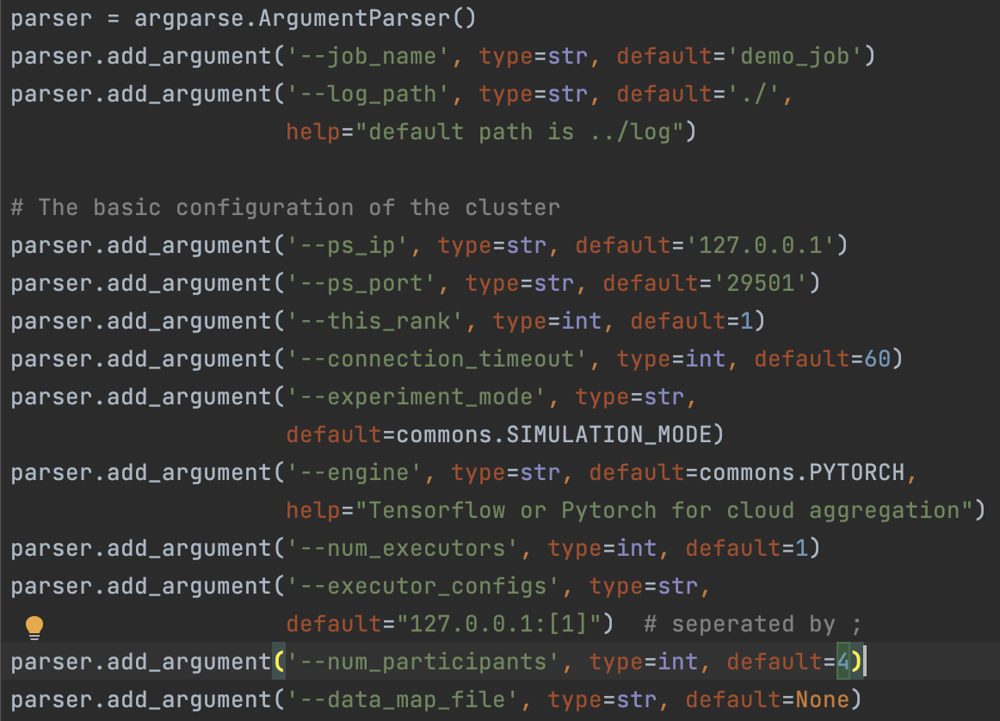
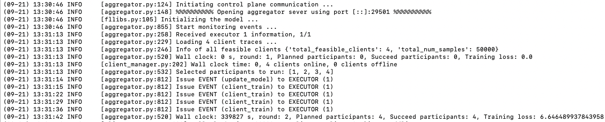
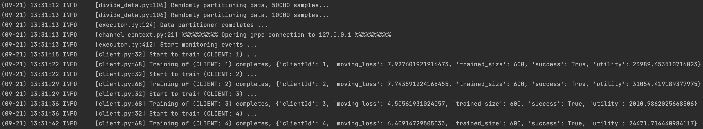

## Flower Example (Advanced_Tensorflow)
> link: https://github.com/adap/flower/tree/main/examples/advanced_tensorflow

* Tensorflow를 활용한 연합학습
  * Cifar10 Dataset
  * Client: 5명
    * 각 Client마다 Train dataset은 5000개, Test dataset은 1000개씩 차이를 둠
    * run_client.sh 파일로 Client 한번에 실행
  * Local epoch: 10, Round: 5, Batch size: 32
  * Weights & Biases로 Client의 Local Model과 Server의 Global Model 성능 모니터링
    * Server의 Global Model 성능 
    </img>  

    * Clients의 Local Model 성능 
    </img> 

## FedScale
> link 1: https://fedscale.ai/  
> link 2: https://github.com/SymbioticLab/FedScale  
* Basic FedScale Example
  * FedScale/example/notebook 코드 사용
    * .ipynb 파일을 .py로 변환하여 파라미터 찾아가며 수행
    * args 활용하여 여러 파라미터 수정 가능  
      * Server: --rounds: 라운드 수
        * Selected Client는 4개 밖에 안됨 => aggregator.py 부분 확인 필요
      * Client: --num_participants: 클라이언트 수 
      </img>
    * server 실행 후 client 실행
    * 실행 결과
      * Server
        * Selected Client의 ID와 라운드별 성능 확인 가능  
         </img> 
        * Client
          * 각 Client의 성능 및 성공/실패 상태 확인  
           </img> 

## Flower vs FedScale
> * config parser(파라미터)를 설정하여 간편하게 연합학습 시뮬레이션 수행 가능
> * 오픈 데이터셋 쉽게 활용 가능
> * Flower에 비해 ClientManager 기능 다양하게 지원(Client Selection 부분도 지원)
>   * Oort sampler:  Oort prioritizes the use of those clients who have both data that offers the greatest utility
        in improving model accuracy and the capability to run training quickly. 
        [Ref]: https://www.usenix.org/conference/osdi21/presentation/lai
> * 단점 
>   * Flower 대비 code 사용 Documentation 부족
>   * 서비스(device에 client 적용)나 플랫폼에 적용하려 했을 때 확장성이 다소 부족하다고 느껴짐
> * 여러 example을 수행하였지만, notebook example만 수행 가능하였음
> * 다른 example도 수행해보고 디버깅 작업을 하여 어떻게 돌아가고 있는지 구조 파악이 필요